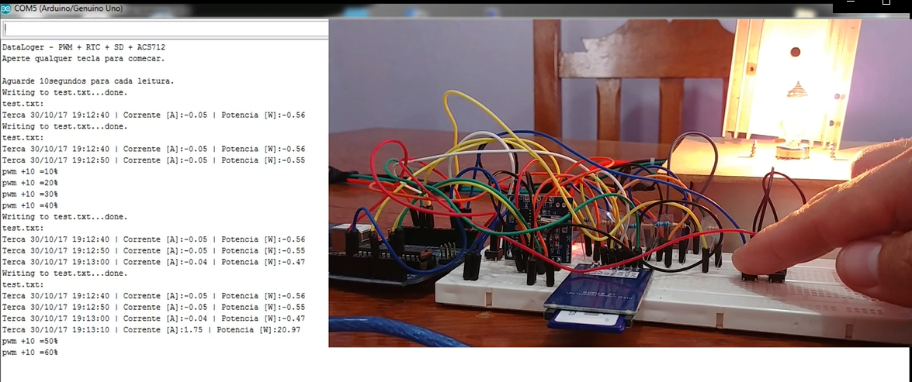

Datalogger_com_PWM_RTC_SD_ACS712

A carga utilizada é uma lâmpada automotiva H7, na qual é feito um controle por PWM, através do controle de chaveamento do transistor TIP122, o qual é controlado pela saída digital do arduino. O resistor da base do transistor foi calculado para que este tenha um ganho de no máximo 4A.
O circuito de alimentação da lâmpada passa pelo senhor de efeito Hall e, a saida analogica deste é lida pela entrada analogica do arduino.
O arduino coleta a data e hora do módulo RTC.
As informações de corrente, cálculo de potência, data e hora são armazenadas e acumuladas em um arquivo tipo lista de extensão .txt dentro do cartão SD a cada 10 segundos.
Existe um botão para deletar o arquivo.
E dois botões para controle do PWM, um para aumentar e outro para diminuir.
A cada 10 segundos todo o arquivo é lido do cartão SD e impresso na serial.

